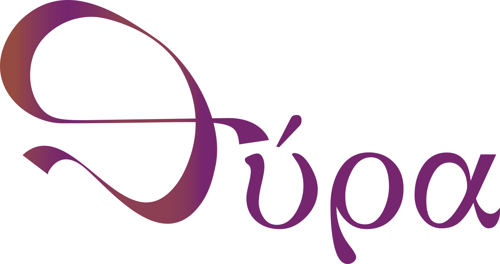
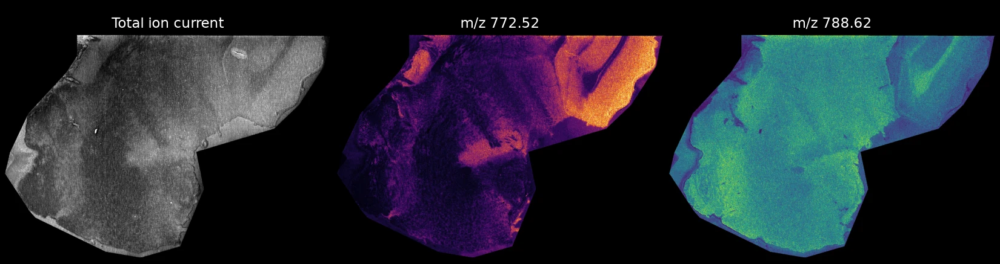

<p align="center">
  
</p>

# Convert imaging mass spectrometry data into one open format

Thyra reads the files your instrument writes and saves them in
[SpatialData](https://spatialdata.scverse.org/), an open format that analysis
and viewing tools can read. Bruker, Waters and PHI data work, and so does
imzML from any vendor.

**You do not need to know how to program.** You install Thyra once. After
that, converting a dataset is one command.

[Install Thyra](install.md){ .md-button .md-button--primary }
[Try it in your browser](https://colab.research.google.com/github/M4i-Imaging-Mass-Spectrometry/thyra/blob/main/notebooks/Thyra_Validation_Workflow.ipynb){ .md-button }

The browser version runs in Google Colab, so it needs a Google account but
nothing on your computer. It converts example data, or an imzML file you
upload.



<small>A sagittal mouse brain section converted with Thyra: the total ion
current and two ion images. MALDI-MSI data from
[10.5281/zenodo.18326569](https://doi.org/10.5281/zenodo.18326569)
(CC-BY-4.0), the dataset in the [Tutorial](tutorial.md).</small>

## How it works

1. **Install** Thyra. The [Install](install.md) page walks you through it.
2. **Convert** a dataset. Give Thyra your data and a name for the result:

    ```bash
    thyra my_slide.d my_slide.zarr
    ```

3. **Open** the result in any tool that reads SpatialData. See
   [Look at the result](look-at-the-result.md).

Thyra works out the file type, the pixel size and the m/z axis for you.

## What you can convert

| Your instrument | Point Thyra at |
|---|---|
| Bruker timsTOF or solariX | the folder ending in `.d` |
| Bruker rapifleX | the acquisition folder |
| Waters (MassLynx) | the folder ending in `.raw` |
| PHI nanoTOF (ToF-SIMS) | the file ending in `.raw` |
| Any instrument that exports imzML | the `.imzML` file, with its `.ibd` file next to it |

Thyra can also read mzPeak files. That support is experimental.

## What you get

One folder ending in `.zarr`. It holds:

- the spectrum of every pixel, on one shared m/z axis
- an image of the total ion current (TIC)
- the optical image of the slide, when the acquisition has one
- the details of the acquisition: instrument, settings and pixel size

## Where to go next

- **New to Thyra?** Start with [Install](install.md), then
  [Your first conversion](getting-started.md).
- **Want to see it work first?** Part 1 of the [Tutorial](tutorial.md) uses
  example data and takes about a minute once Thyra is installed.
- **Converting your own data?** See [Which files can I convert?](which-files.md)
  and [Change how Thyra converts](settings.md).
- **Want every detail?** The [Technical reference](technical-reference.md)
  covers every option and every format.

---

## Acknowledgments

The Thyra logomark and logotype were designed by **Nepsis Scriptorium**.

[](https://www.instagram.com/nepsis.scriptorium/)
[](mailto:nepsisscriptorium@gmail.com)

Thyra is built on [SpatialData](https://spatialdata.scverse.org/),
[Zarr](https://zarr.readthedocs.io/) and
[pyimzML](https://github.com/alexandrovteam/pyimzML).
